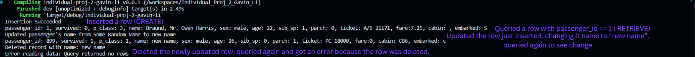
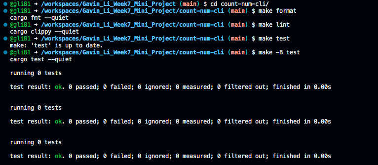

# IDS 706 Data Engineering Individual Project 2

Gavin Li `gl183`

## Purpose of the Project

The purpose of this project is to manipulate SQLite database and perform CRUD operations using Rust.

## Video Explanation

[Here is a video explaining my project](https://youtu.be/amfXO4-dEgw)

## Use of Github Copilot

I generated most of my Rust code manipulating the database using Gituhb Copilot.

- Advantages of Copilot:

    - It gives me a framework of how to interact with SQLite. All I need to do is to fill in the logic that I want to implement on SQL queries. Making coding more efficient.

    - The code is mostly correct. :D

## Program Dependencies

- csv

    Used to handle .csv file.

- reqwest

    Used to extract the dataset by sending HTTP requests.

- rusqlite
    
    Used to interact with SQLite database.

To install dependencies, put package names in the `Cargo.toml` file.

## The Dataset and Data Manipulation

The data is from the training set of kaggle dataset Titanic. I first extracted all the data from the website, and loaded them into a csv file. Then I created a SQLite database to store all the data.

### CRUD

The program primarily runs each of the CRUD operations. To run the program, use the `cargo run` command.

- Creation

    I created a new record with some make up data, and insert that record to the dataset.

- Read

    I queried the database for the record with `passenger_id = 1`.

- Update
    I updated the row I just inserted, changing its `name` from `Some Random Name` to `new name`

- Delete
    I deleted the row with `name = "new name"`

Below is the results of my CRUD operations.

## Result for `make format`, `make lint`, `make test`

Note that there are two warnings for `make lint`. The warnings are caused by the argument list & return value type being too long. As the nature of my dataset having too many columns, it is necessary now to keep these arguments and return value type when defining my functions, so I will ignore the warnings now. _For future improvement, it would be better to create a struct to represent a row in the dataset, making the argument just an object for that struct, reducing the number of arguments for the function._

## References

* [Professor Noah's rust data engineering repo](https://github.com/nogibjj/rust-data-engineering)
