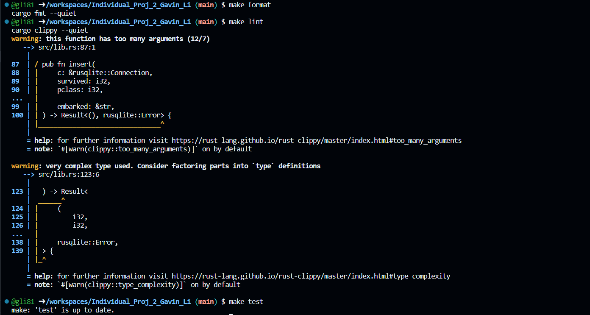

# IDS 706 Data Engineering Individual Project 2

Gavin Li `gl183`

## Purpose of the project

The purpose of this project is to manipulate SQLite database and perform CRUD operations using Rust.

## Use of Github Copilot

I generated my Rust code manipulating the database using

## Result for `make format`, `make lint`, `make test`

## References

* [Professor Noah's rust data engineering repo](https://github.com/nogibjj/rust-data-engineering)
